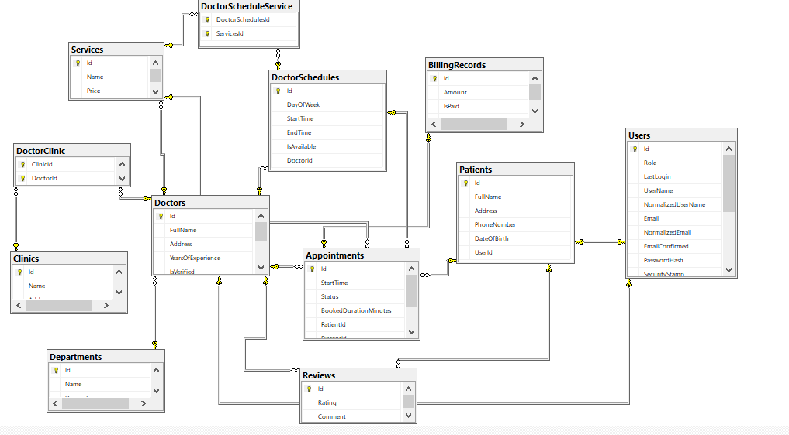

# 🏥 ONLINE BOOKING DOCTOR API

<p align="center">
  
  
  
  
</p>

A robust API for an online doctor appointment booking system, facilitating seamless interaction between patients, doctors, and public users.

---

## 🛠️ Tech Stack & Architecture

Built on the latest .NET Core, the API employs a clean, layered architecture for separation of concerns and testability.

| Category | Technology | Badge | Why we chose it |
| :--- | :--- | :--- | :--- |
| **Backend** | **.NET 9** (C#) |  | Performance, robustness, and a powerful ecosystem. |
| **Database** | **SQL Server** |  | Reliability and transactional integrity for core content. |
| **ORM** | **Entity Framework Core** |  | Fluent, type-safe data access and migration management. |
| **Authentication**| **JWT Bearer** |  | Secure, stateless authentication for all endpoints. |

## 🔒 Security and Authentication

This API uses **Bearer Token** authentication for all secure endpoints. You must include a valid JWT in the `Authorization` header of your requests in the format: `Bearer <your_token>`.

### Logout Security Enhancement

We have implemented the **AuthorizeV1Filter** for the logout endpoint (`/api/Account/Logout`). This ensures that only authenticated users can initiate a logout, correctly invalidating the session or token and protecting against unauthorized access to this critical security feature.

### Account Endpoints

| Method | Endpoint | Description | Access |
| :--- | :--- | :--- | :--- |
| `POST` | `/api/Account/Register` | Register a new user (Patient or Doctor). | Public |
| `POST` | `/api/Account/Login` | Authenticate a user and receive a token. | Public |
| `POST` | `/api/Account/Logout` | Invalidate the current user's session/token. | Authenticated |
| `GET` | `/api/Account/me` | Retrieve the current user's details. | Authenticated |
| `GET` | `/api/Account/EmailExists` | Check if an email is already registered. | Public |

---

## 👤 User Roles and Capabilities

The system supports three main user types: **Non-Registered Users (Public)**, **Patients**, and **Doctors**.

### 🌍 Non-Registered User (Public) Capabilities

A user who hasn't logged in or registered can perform essential search and viewing actions:

* **View Departments:** Retrieve a paginated list of medical departments.
    * `GET /api/public/departments`
* **Search Doctors:** Find doctors by name or filter by department.
    * `GET /api/public/doctors`
* **View Doctor Profile:** Get detailed information for a specific doctor.
    * `GET /api/public/doctors/{DoctorId}`
* **View Doctor Schedule:** Check a doctor's available appointment slots.
    * `GET /api/public/doctors/{DoctorId}/schedule`
* **View Doctor Reviews:** See reviews and ratings for a specific doctor.
    * `GET /api/public/doctors/{DoctorId}/reviews`

---

### 💚 Patient Capabilities (Authenticated)

Patients can manage their profile, book appointments, and leave feedback:

| Action | Endpoint | Method |
| :--- | :--- | :--- |
| **Profile Management** | `/api/Patient/me/profile` | `POST`, `GET`, `PUT` |
| **Book Appointment** | `/api/Appointment` | `POST` |
| **View Specific Appointment** | `/api/Appointment/{Appointmentid}` | `GET` |
| **Cancel Appointment** | `/api/Appointment/{Appointmentid}/cancel` | `PUT` |
| **View All Appointments** | `/api/Patient/me/appointments` | `GET` |
| **Submit Review** (for a doctor) | `/api/Review/{doctorId}` | `POST` |
| **Delete Review** (their own) | `/api/Review/{Reviewid}` | `DELETE` |

---

### 👨‍⚕️ Doctor Capabilities (Authenticated)

Doctors can manage their profile, services, schedules, and appointments:

| Action | Endpoint | Method |
| :--- | :--- | :--- |
| **Profile Management** | `/api/Doctor/me/profile` | `POST`, `GET`, `PUT` |
| **Add Clinic Affiliation** | `/api/Doctor/me/clinics/{clinicId}` | `POST` |
| **Create Service** | `/api/services` | `POST` |
| **View Services** | `/api/Doctor/me/services` | `GET` |
| **Update Service** | `/api/services/{ServiceId}` | `PUT` |
| **Delete Service** | `/api/services/{ServiceId}` | `DELETE` |
| **Create Schedule** | `/api/Schedule/schedules` | `POST` |
| **View Schedules** | `/api/Doctor/me/schedules` | `GET` |
| **Update Schedule** | `/api/Schedule/schedules/{ScheduleId}` | `PUT` |
| **Delete Schedule** | `/api/Schedule/schedules/{ScheduleId}` | `DELETE` |
| **View All Appointments** | `/api/Doctor/me/appointments` | `GET` |
| **Confirm Appointment** | `/api/Appointment/{Appointmentid}/confirm` | `PUT` |
| **View Billing Records** | `/api/billing/records` | `GET` |

---
## 🚀 Getting Started

Follow these steps to run the BlogSphere API locally.

### Prerequisites

* [.NET 8 SDK](https://dotnet.microsoft.com/en-us/download)
* **Git**
* **SQL Server** instance (or set up a different provider in your connection string)

### Local Installation

1.  **Clone the Repository**
    ```sh
    git clone [https://github.com/Omar-Abdo1/OnlineBookingDoctorAPI.git](https://github.com/Omar-Abdo1/OnlineBookingDoctorAPI.git)
    cd BlogAPI
    ```

2.  **Configure Environment**
    Create or modify your `appsettings.Development.json` (or use `dotnet user-secrets`) to set up your database connection string and JWT key.

    ```json
    {
      "ConnectionStrings": {
        "DefaultConnection": "Server=YourServer;Database=BlogDB;User Id=...;Password=..."
      },
      "Token": {
        "Key": "A_VERY_LONG_AND_SECURE_JWT_KEY_HERE_MIN_128_BITS",
        "Issuer": "https://localhost:5001/"
      }
    }
    ```
    *It is highly recommended to use the `dotnet user-secrets` tool to store sensitive data.*

3.  **Run Database Migrations**
    Initialize your database schema using Entity Framework Core tools.
    ```sh
    dotnet ef database update
    ```

4.  **Launch the API**
    ```sh
    dotnet run
    ```
    The API should now be running and accessible at `https://localhost:5001`. You can access the **Swagger UI** for testing at `https://localhost:5001/swagger`.

---

## 🖼️ Database Schema

The core of OnlineBookingDoctor is defined by its relational structure, designed for transactional integrity and efficient querying.

The diagram below illustrates the main tables and their one-to-many relationships (Foreign Keys):

<p align="center">
   
</p>
---

## 🤝 Contribution & Contact

Contributions are what make the open-source community such an amazing place to learn, inspire, and create. Any contributions you make are **greatly appreciated**.

* **Project Link**: [https://github.com/Omar-Abdo1/OnlineBookingDoctorAPI](https://github.com/Omar-Abdo1/OnlineBookingDoctorAPI)
* **Author**: **Omar Abdo**
* **Email**: [OmarRadwan10a@gmail.com](mailto:OmarRadwan10a@gmail.com)

Feel free to open an issue for bug reports, feature requests, or any suggestions!


